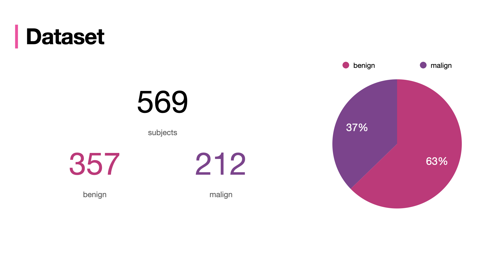

# AGDB Final Project

Given a [dataset](https://www.kaggle.com/datasets/yasserh/breast-cancer-dataset) in which 569 women that have been diagnosed with **breast cancer** in two different stages (benign vs malign), using both **classical statistical approach** and **deep learning**, establish a way of classifying based on the data given, if a patient is **likely to have a high stage of cancer**. 

